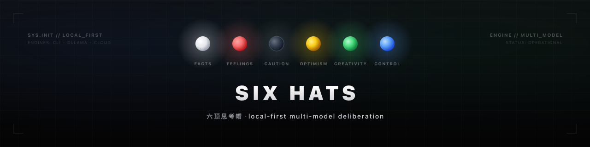

[English](README.md) | **中文**

<p align="center">
  
</p>

# Six Hats

一个基于爱德华·德博诺（Edward de Bono）六顶思考帽方法的本地优先协作看板 —— 六个 AI 角色从六个不同角度就你的话题展开讨论，最后由其中一个角色综合归纳出结论。

## 下载

**[下载 macOS App（Apple Silicon）](https://github.com/s20sc/six-hats/releases/latest)** —— 从最新 release 里取 `.dmg`。

该 App **暂未签名/公证**，首次打开需：**右键 → 打开**（一次即可），或在终端运行 `xattr -cr "/Applications/Six Hats.app"`。Intel Mac 或其他系统请改用[源码运行](#快速开始)。

## 这是什么

你给出一个话题，六顶帽子会各自以其角色发言：

| 帽子 | 角色 |
|---|---|
| ⚪ 白帽 | 事实、数据、信息缺口 —— 不做评价 |
| 🔴 红帽 | 直觉、情绪、第一反应 |
| ⚫ 黑帽 | 审慎 —— 风险、缺陷、为什么可能行不通 |
| 🟡 黄帽 | 乐观 —— 价值、收益、可行性 |
| 🟢 绿帽 | 创造力 —— 新点子、替代方案、发散思维 |
| 🔵 蓝帽 | 综合 —— 阅读其余五顶帽子的发言并给出结论 |

每顶帽子可以由*不同*的模型驱动。Six Hats 会自动探测你机器上或 `.env` 中可用的 AI 引擎，并为每顶帽子随机分配一个引擎。运行前你可以把某顶帽子固定（pin）到指定引擎，也可以重新随机分配（reroll）。

## 功能特性

- **六角度并行 + 蓝帽收尾**：五顶帽子并行发言，蓝帽读完再综合出结论与下一步建议。
- **引擎池自动探测**：启动即发现本地 CLI（`claude`/`codex`/`agy`/`hermes`/`openclaw`）、本地 Ollama 模型、自定义命令模板、以及配了 key 的 OpenAI 兼容云端。
- **本地优先，云端兜底**：有本地引擎就优先用本地，全都没有才用云端；隐私友好、可离线。
- **每帽可用不同模型**：随机分配到具体模型，让六个角度真正来自不同"声音"；可钉住、可重随。
- **单帽刷新 🔄**：某顶超时或不满意，只重跑那一顶，不必全部重来（蓝帽刷新会自动带上其余五帽的最新发言）。
- **一键复制 / 导出 📋**：每顶帽子的发言可单独复制，蓝帽结论可复制，顶部「复制全部」把议题 + 六帽发言 + 结论导出为 Markdown，直接粘进笔记。
- **自动过滤 embedding 模型**：名字含 `embed` 的模型（如 `nomic-embed-text`）不会被分配到帽子，省得空跑报错。
- **跨平台 · 自带 key（BYO-key）**：macOS / Windows / Linux，装了 Node 即可运行。

## 工作原理

- **引擎池（Engine Pool）**：服务启动时会探测本地 Agent CLI（`claude`、`codex`、`agy`、`hermes`、`openclaw`）、本地 Ollama 模型、你在 `config.json` 中定义的自定义命令模板，以及 OpenAI 兼容的云端接口（只有当对应 API key 在 `.env` 中配置时才会启用）。
- **本地优先（Local-first）**：在为帽子分配引擎时，优先使用本地引擎（CLI 工具、Ollama），云端引擎作为补充。
- **云端兜底（Cloud fallback）**：如果没有检测到任何本地引擎，只要至少配置了一个 API key，云端引擎会自动补位。
- **蓝帽总结**：其余五顶帽子先并行发言，随后蓝帽读取全部五份发言，给出综合结论。
- 除了 Node.js 之外没有硬性依赖 —— 云端 key 和 Ollama 都是可选的。如果什么引擎都没检测到，看板会明确提示无可用引擎，而不是静默失败。

## 环境要求

- Node.js ≥ 18
- 可选：`claude`、`codex`、`agy`、`hermes`、`openclaw` 中的任意 CLI，需在 `PATH` 中
- 可选：本地运行的 [Ollama](https://ollama.com)，并已拉取至少一个模型
- 可选：一个 OpenAI 兼容云端服务商的 API key（OpenAI、OpenRouter 等）

## 快速开始

```bash
cp .env.example .env
# 可选：cp config.example.json config.json
npm install
npm run build
npm start
```

打开 http://localhost:3002。

开发模式（热重载）：

```bash
npm run dev
```

## 使用本地 Agent

如果你安装了 `claude`、`codex`、`agy`、`hermes`、`openclaw` 中的任意一个并加入了 `PATH`，Six Hats 启动时会自动发现它们，无需额外配置。如果本地正在运行 [Ollama](https://ollama.com)，所有已拉取的模型也会自动加入引擎池。

要使用 `openclaw`，需要在 `config.json` 中把 `openclawAgent` 设置为你想驱动的 agent id（默认是 `null`，即禁用，因为它需要显式指定 agent id）：

```json
{ "openclawAgent": "my-agent-id" }
```

## 使用云端引擎

将 `.env.example` 复制为 `.env`，填入你拥有的任意 key：

```bash
OPENAI_API_KEY=sk-...
OPENROUTER_API_KEY=sk-or-...
```

只有配置了 key 的云端服务商才会出现在引擎池中 —— 留空即为禁用。服务商、baseUrl 和模型列表都来自 `config.json`（参见 `config.example.json`）；复制该文件后编辑 `cloud` 数组即可增删或调整模型。

## 自定义 CLI 模板

你可以通过 `config.json` 中的 `custom` 数组把任意命令行工具接入引擎池。话题 prompt 会通过 `SIXHATS_PROMPT` 环境变量传给你的命令，stdout 即作为该帽子的回复：

```json
{
  "custom": [
    { "name": "my-tool", "cmd": "my-tool --prompt \"$SIXHATS_PROMPT\"", "parse": "raw" }
  ]
}
```

自定义模板始终通过 POSIX shell（`sh`）运行，请使用 `"$SIXHATS_PROMPT"` 引用话题内容；在 Windows 上请使用 WSL 或 Git Bash 提供 `sh`。

## 皮肤（Skins）

无需改代码即可重命名帽子或更换 emoji，通过 `config.json` 中的 `skins` 对象配置：

```json
{
  "skins": {
    "white": { "name": "事实机器人", "emoji": "📄" }
  }
}
```

## 许可证

[MIT](LICENSE)
